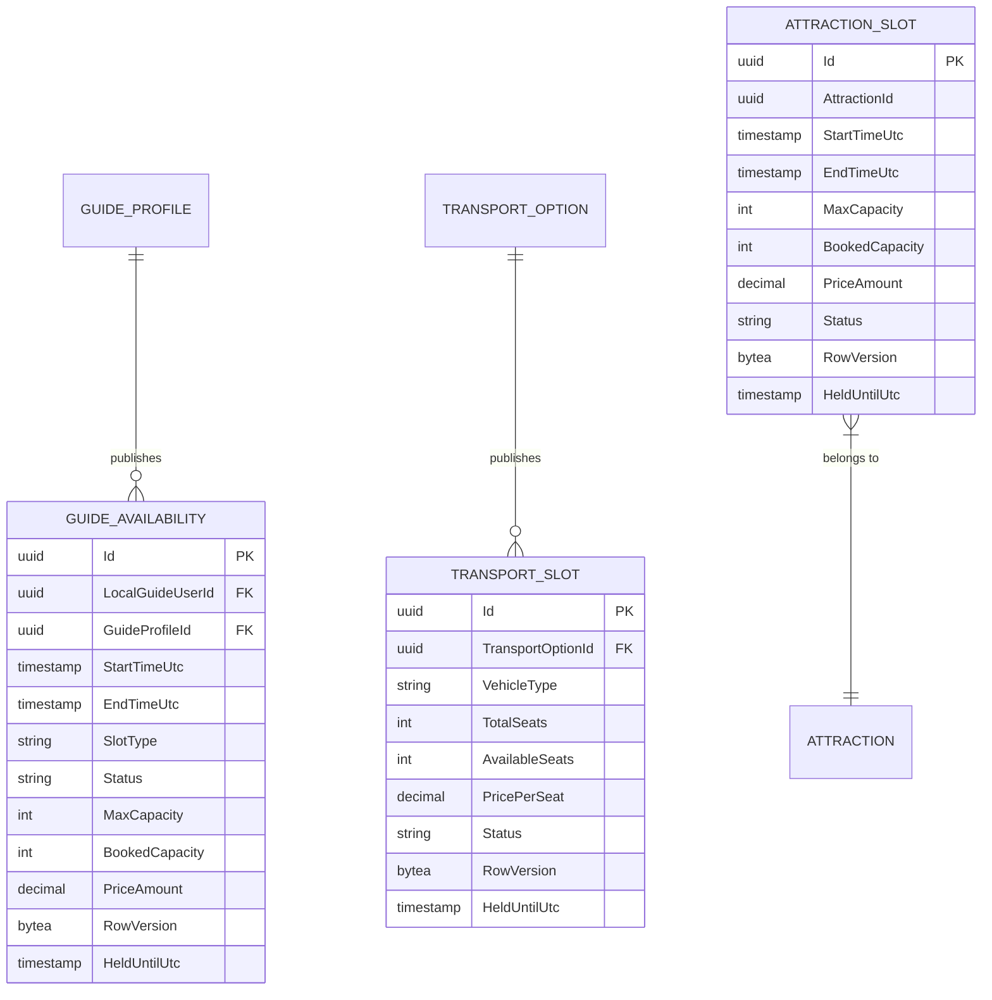
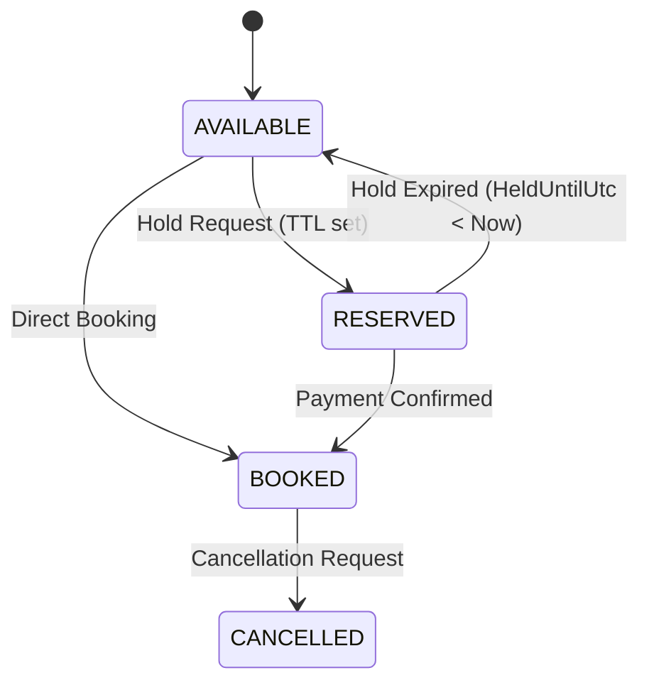

# CeylonMate - Capacity Subsystem Architecture & Concurrency Specification

## 1. Executive Summary

The **Capacity Subsystem** (Member 3 Domain) in CeylonMate provides real-time, highly concurrent availability management, optimistic locking checks, resource hold/expiry lifecycle management (TTL), and multi-resource feasibility validation for Local Guides, Transport Options, and Attraction Sites.

The subsystem guarantees **zero double-bookings** across concurrent requests while providing high-performance, non-blocking read access for itinerary generation and availability searching.

---

## 2. Domain Architecture & Data Models

The subsystem manages three core capacity entities mapped via Entity Framework Core (PostgreSQL):



### Key Domain Properties
- **`RowVersion` (`byte[]`)**: Serves as the optimistic concurrency token for every resource slot entity.
- **`HeldUntilUtc` (`DateTimeOffset?`)**: Tracks temporary time-to-live (TTL) reservation holds during checkout.
- **`Status`**: Lifecycle state machine (`AVAILABLE`, `RESERVED`, `BOOKED`, `BLOCKED`, `CANCELLED`).

---

## 3. Optimistic Concurrency Control (OCC) Deep Dive

### 3.1 Architectural Justification: Optimistic Concurrency vs. Pessimistic Locking

> [!IMPORTANT]
> **Why Optimistic Concurrency was Chosen over Pessimistic Locking:**
> 1. **High Read-to-Write Ratio**: In travel platforms, search queries outnumber actual bookings by 100:1. Pessimistic locking (`SELECT ... FOR UPDATE`) acquires database row/table locks during read phases, causing thread pool starvation and severe API latency.
> 2. **Deadlock Prevention**: Multi-resource bookings (reserving a Guide + Vehicle + Entrance Ticket simultaneously) under pessimistic locking risk cross-table deadlocks if transactions acquire locks in different orders.
> 3. **Non-Blocking Execution**: Optimistic Concurrency requires zero database locks during reads. Write conflicts are detected atomically during `SaveChangesAsync()`, ensuring maximum throughput.

### 3.2 PostgreSQL & EF Core Implementation Details

PostgreSQL `bytea` columns do not automatically generate row version timestamps like SQL Server's native `rowversion` type. To achieve robust cross-database concurrency checking in EF Core:

1. **Model Configuration (`CeylonMateDbContext.cs`)**:
   ```csharp
   guideAvailability.Property(x => x.RowVersion)
                    .IsConcurrencyToken()
                    .ValueGeneratedNever();
   ```
   Configuring `.IsConcurrencyToken().ValueGeneratedNever()` informs EF Core to include the `RowVersion` byte array in both `INSERT` and `UPDATE` SQL statements.

2. **GUID Byte Array Mutation Strategy**:
   On every entity mutation, application code explicitly updates `RowVersion` with a new unique byte sequence:
   ```csharp
   slot.RowVersion = Guid.NewGuid().ToByteArray();
   slot.UpdatedAtUtc = DateTimeOffset.UtcNow;
   ```

3. **Generated SQL Execution**:
   ```sql
   UPDATE guide_availabilities
   SET "BookedCapacity" = @p0, "Status" = @p1, "RowVersion" = @p2, "UpdatedAtUtc" = @p3
   WHERE "Id" = @p4 AND "RowVersion" = @p5;
   ```
   If another user modified the slot between read and write operations, `"RowVersion"` in the database will no longer match `@p5`. The `UPDATE` statement matches `0` rows, causing EF Core to throw `Microsoft.EntityFrameworkCore.DbUpdateConcurrencyException`.

### 3.3 HTTP 409 Conflict & Mobile UX Feedback Integration

When a concurrency conflict occurs:

1. **Backend Layer (`CapacityReservationService.cs`)**:
   ```csharp
   catch (DbUpdateConcurrencyException)
   {
       await transaction.RollbackAsync(ct);
       return ReservationResultDto.Failure(
           "Concurrency conflict detected while attempting to reserve resources. Double-booking prevented.", 
           "CONCURRENCY_CONFLICT"
       );
   }
   ```
2. **Controller Layer (`CapacityController.cs`)**:
   Maps unsuccessful reservation results with `ConflictResourceType == "CONCURRENCY_CONFLICT"` directly to an `HTTP 409 Conflict` response.
3. **Mobile Client Layer (`guide_availability_service.dart` & `add_edit_availability_screen.dart`)**:
   Intercepts `DioException` with status code `409` and displays a user-friendly SnackBar notification:
   > *"Slot is no longer available or was booked by another user. Please choose a different slot."*

---

## 4. Reservation & Hold Lifecycle (TTL Engine)

Resource slot allocations follow an explicit lifecycle state machine:



### Automated Hold Release Mechanics
1. **Hold Request**: When a traveler holds a slot during checkout, `ReserveResourcesAsync` sets `Status = RESERVED` and populates `HeldUntilUtc = DateTimeOffset.UtcNow.AddMinutes(holdDuration)`.
2. **Auto-Release Trigger**: Before executing any search, availability query, or reservation attempt, `CapacityReservationService` executes `ReleaseExpiredHoldsAsync()`:
   ```csharp
   var expiredGuideHolds = await db.GuideAvailabilities
       .Where(x => x.Status == AvailabilityStatus.RESERVED && x.HeldUntilUtc.HasValue && x.HeldUntilUtc.Value < DateTimeOffset.UtcNow)
       .ToListAsync(ct);

   foreach (var slot in expiredGuideHolds) {
       slot.Status = AvailabilityStatus.AVAILABLE;
       slot.BookedCapacity = Math.Max(0, slot.BookedCapacity - 1);
       slot.HeldUntilUtc = null;
       slot.RowVersion = Guid.NewGuid().ToByteArray();
   }
   ```

---

## 5. Automated Testing & Verification

The subsystem is fully verified via automated xUnit integration tests in `backend/CeylonMate.Tests`:

| Test Name | Description | Status |
|---|---|---|
| `ReserveSlot_SimultaneousRequests_ThrowsDbUpdateConcurrencyException_ForSecondCaller` | Simulates two simultaneous requests attempting to book the same slot using a stale `RowVersion`. Asserts second caller throws `DbUpdateConcurrencyException` and verifies DB state reflects exactly 1 booking. | ✅ PASSED |
| `AddGuideAvailability_ValidSlot_AddsSuccessfully` | Verifies creating valid guide slots with correct DTO mapping. | ✅ PASSED |
| `GetGuideAvailability_DateRangeFiltering_ReturnsOnlyMatchingSlots` | Verifies filtering guide slots strictly within specified date bounds. | ✅ PASSED |
| `AddGuideAvailability_EndTimeBeforeOrEqualStartTime_ThrowsArgumentException` | Asserts that `EndTimeUtc <= StartTimeUtc` is rejected with an `ArgumentException`. | ✅ PASSED |
| `RegisterLoginAndMe_ReturnExpectedResponses` | Verifies auth pipeline integration. | ✅ PASSED |
| `InvalidRequests_ReturnCorrectStatusCodes` | Verifies payload validation and HTTP error status codes. | ✅ PASSED |
| `DuplicateEmail_ReturnsConflictIgnoringCase` | Verifies account uniqueness enforcement. | ✅ PASSED |

---

## 6. Frontend Integration & Mobile Architecture

The mobile client (`mobile/lib/features/`) provides dedicated views for local guides and travelers:

1. **`MyAvailabilityScreen`**:
   - Monthly calendar view for Local Guides.
   - Status filter chips (`All`, `Available`, `Reserved`, `Booked`, `Blocked`).
   - Pull-to-refresh and real-time slot synchronization.

2. **`AddEditAvailabilityScreen`**:
   - Segmented slot type button (`Full Day`, `Morning`, `Afternoon`, `Hourly`).
   - Date and time pickers with validation enforcing `EndTime > StartTime`.
   - Graceful HTTP 409 SnackBar handling on concurrency collisions.

3. **`ResourceFeasibilityView`**:
   - Reusable traveler itinerary card.
   - Displays real-time allocation status chips (`Confirmed`, `Pending`, `Unavailable`) for Guide, Transport, and Attraction resources.
