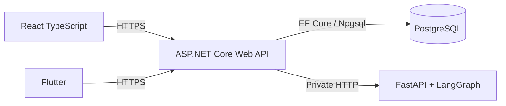

# System context

```mermaid
flowchart LR
  Web[React TypeScript] -->|HTTPS| API[ASP.NET Core Web API]
  Mobile[Flutter] -->|HTTPS| API
  API -->|EF Core / Npgsql| DB[(PostgreSQL)]
  API -->|Private HTTP| AI[FastAPI + LangGraph]
```

The absence of client-to-database and client-to-AI edges is an enforced architectural boundary.
