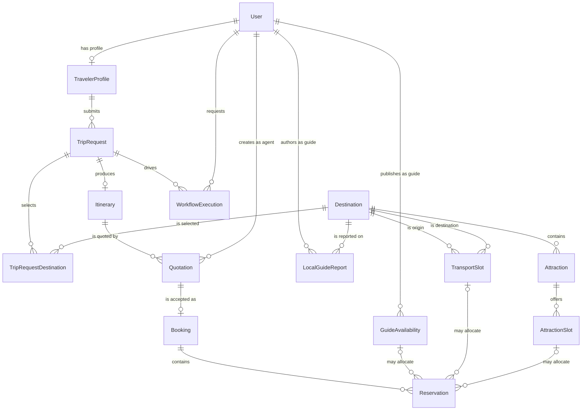

# CeylonMate minimal domain schema contract

- Status: Proposed shared contract
- Date: 2026-09-12
- Scope: relationship and migration boundaries only; this does not authorize feature implementation

This is the smallest schema agreement required before four workstreams create entities or migrations. Attributes not listed here remain owned by the feature workstream.

## Relationship map



`TripRequestDestination` is the only additional join entity required by this contract. A trip can cover multiple destinations. Do not put a single `DestinationId` on `TripRequest`.

## Foreign keys and delete behavior

The dependent entity owns and configures each FK. All FK columns are required unless marked nullable. PostgreSQL FK columns use `uuid`.

| Dependent | FK | Principal | Cardinality | On delete | Constraint/invariant |
|---|---|---|---|---|---|
| `TravelerProfile` | `UserId` | `User.Id` | one-to-zero/one | `Cascade` | Unique FK; only a `TRAVELER` user may own it (application rule). |
| `TripRequest` | `TravelerProfileId` | `TravelerProfile.Id` | many-to-one | `Restrict` | Required. |
| `TripRequestDestination` | `TripRequestId` | `TripRequest.Id` | many-to-one | `Cascade` | Composite PK with `DestinationId`. |
| `TripRequestDestination` | `DestinationId` | `Destination.Id` | many-to-one | `Restrict` | Composite PK with `TripRequestId`. |
| `Attraction` | `DestinationId` | `Destination.Id` | many-to-one | `Restrict` | Required. |
| `LocalGuideReport` | `LocalGuideUserId` | `User.Id` | many-to-one | `Restrict` | Required; role check is an application rule. |
| `LocalGuideReport` | `DestinationId` | `Destination.Id` | many-to-one | `Restrict` | Required. |
| `GuideAvailability` | `LocalGuideUserId` | `User.Id` | many-to-one | `Restrict` | Required; index guide plus start/end UTC. |
| `TransportSlot` | `OriginDestinationId` | `Destination.Id` | many-to-one | `Restrict` | Required and different from `DestinationId`. |
| `TransportSlot` | `DestinationId` | `Destination.Id` | many-to-one | `Restrict` | Required. |
| `AttractionSlot` | `AttractionId` | `Attraction.Id` | many-to-one | `Restrict` | Required; index attraction plus start/end UTC. |
| `Itinerary` | `TripRequestId` | `TripRequest.Id` | one-to-zero/one | `Restrict` | Unique FK; version itinerary changes rather than replacing this FK. |
| `Quotation` | `ItineraryId` | `Itinerary.Id` | many-to-one | `Restrict` | Required. Multiple quotation revisions are allowed. |
| `Quotation` | `TravelAgentUserId` | `User.Id` | many-to-one | `Restrict` | Required; role check is an application rule. |
| `Booking` | `QuotationId` | `Quotation.Id` | one-to-zero/one | `Restrict` | Unique FK; only an accepted quotation can be booked. |
| `Reservation` | `BookingId` | `Booking.Id` | many-to-one | `Restrict` | Required. |
| `Reservation` | `GuideAvailabilityId` | `GuideAvailability.Id` | many-to-one | `Restrict` | Nullable resource FK. |
| `Reservation` | `TransportSlotId` | `TransportSlot.Id` | many-to-one | `Restrict` | Nullable resource FK. |
| `Reservation` | `AttractionSlotId` | `AttractionSlot.Id` | many-to-one | `Restrict` | Nullable resource FK. |
| `WorkflowExecution` | `TripRequestId` | `TripRequest.Id` | many-to-one | `Restrict` | Required. AI execution never owns the trip. |
| `WorkflowExecution` | `RequestedByUserId` | `User.Id` | many-to-one | `Restrict` | Required. |

`Reservation` has a database check constraint requiring exactly one resource FK to be non-null. Use separate reservation rows when a booking allocates multiple resources. Do not use a polymorphic `ResourceType`/`ResourceId` pair because PostgreSQL could not enforce those foreign keys.

`Restrict` means `DeleteBehavior.Restrict`, not EF's provider-dependent default. Domain and audit records are never silently removed. Prefer status transitions such as archived or cancelled over hard deletion.

## Audit and status history

Every mutable entity, including `User`, has these required fields:

```text
CreatedAtUtc  timestamp with time zone  NOT NULL
UpdatedAtUtc  timestamp with time zone  NOT NULL
```

- Values are UTC `DateTimeOffset`; API properties retain the `Utc` suffix.
- Set both fields on insertion and update only `UpdatedAtUtc` on modification through one EF `SaveChanges` interceptor.
- Do not accept either field from request DTOs.
- The existing `User` model currently lacks `UpdatedAtUtc`; the Identity owner adds it in the next identity-owned migration.

Do not create one polymorphic global history table. Each stateful aggregate owner creates an append-only `<Aggregate>StatusHistory` table with this common shape:

```text
Id                 uuid                     PK
<Aggregate>Id      uuid                     FK, Restrict
FromStatus         varchar(32)              NULL only for initial transition
ToStatus           varchar(32)              NOT NULL
ChangedAtUtc       timestamp with time zone NOT NULL
ChangedByUserId    uuid                     NULL, FK User.Id, SetNull
Reason             varchar(500)             NULL
```

Create histories only for aggregates that actually transition state: initially `TripRequest`, `Itinerary`, `Quotation`, `Booking`, `Reservation`, and `WorkflowExecution`. Append the history row in the same database transaction as the aggregate update. History rows are immutable and are not exposed as EF navigation collections unless the feature needs them.

## Naming contract

- Entity types, enum types, properties, and DTO types: `PascalCase`.
- Database tables and columns: retain EF Core's current `PascalCase` column convention and explicit lowercase plural table names (for example `users`, `trip_requests`). Do not introduce a global naming plugin midstream.
- Enum member names, PostgreSQL string values, and JSON values: `UPPER_SNAKE_CASE`, matching the existing `UserRole`. Store enums as `varchar(32)`, never PostgreSQL native enum types or integers.
- Incoming DTOs: `<Action><Entity>Request` when an entity name adds clarity, otherwise the established action name such as `RegisterRequest`.
- Single-resource outgoing DTOs: `<Entity>Response`; collections: `PagedResponse<<Entity>Response>`.
- Never serialize EF entities directly. Response DTOs expose IDs as `Guid` and timestamps as ISO-8601 UTC values.
- FK property names are always `<PrincipalType>Id`; navigation names omit `Id`.

## Exclusive edit ownership

An owner may change its listed entities and their `IEntityTypeConfiguration<T>` files. Cross-owner relationships are configured only on the dependent side listed above; do not edit a principal entity merely to add a navigation collection.

| Workstream/member | Exclusive entities | May reference, but must not edit |
|---|---|---|
| 1 — Identity and traveler | `User`, `TravelerProfile` | None. Publishes `User.Id` and `TravelerProfile.Id` as stable contracts. |
| 2 — Catalog and capacity | `Destination`, `Attraction`, `LocalGuideReport`, `GuideAvailability`, `TransportSlot`, `AttractionSlot` | `User` |
| 3 — Trip planning and AI workflow | `TripRequest`, `TripRequestDestination`, `Itinerary`, `WorkflowExecution` | `User`, `TravelerProfile`, `Destination` |
| 4 — Quotation and booking | `Quotation`, `Booking`, `Reservation` | `User`, `Itinerary`, `GuideAvailability`, `TransportSlot`, `AttractionSlot` |

Shared infrastructure has one temporary schema integrator:

- Only the integrator edits `CeylonMateDbContext`, common audit infrastructure, enum JSON configuration, or migration documentation.
- Feature owners use `IEntityTypeConfiguration<T>` and `db.Set<T>()`; they do not add feature `DbSet` properties to the shared context.
- Do not commit independently generated EF model snapshots in parallel. Merge entity/configuration work first, then the integrator generates the combined migration. If separate migrations are mandatory, serialize them: rebase on the latest migration, delete the stale local migration, and regenerate. Never hand-merge `CeylonMateDbContextModelSnapshot.cs`.
- A cross-owner schema change requires approval from both entity owners and the schema integrator.

## Deliberately deferred

This contract does not define feature fields, endpoint payloads, status values or transitions, itinerary-item structure, pricing breakdowns, payment, or external provider identifiers. Those decisions stay within the owning workstream and must not change the relationships above without a contract update.
